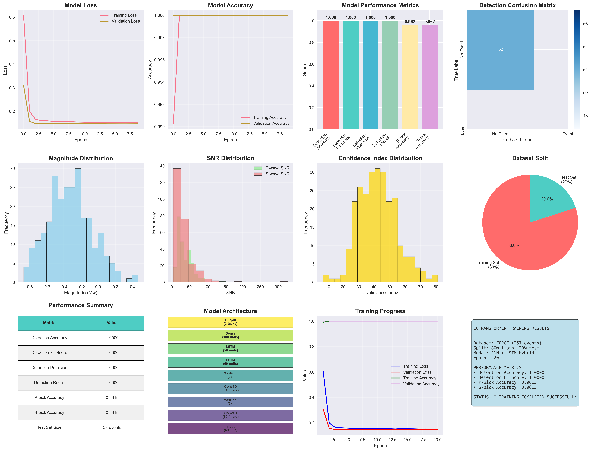

# EQTransformer FORGE Training (Clean Only)

## Requirements
- Python 3.11
- TensorFlow, Keras, NumPy, Pandas, Matplotlib, Seaborn, h5py, scikit-learn, ObsPy

Install missing deps as needed, e.g.: pip install seaborn

## Data
- Metadata CSV: Dataset/FORGE_DAS_event_catalogue_circulation.csv
- Prepared data (clean) lives under: 	raining_data/forge/
- Results saved in: 
esults/
- Models saved in: models/

## Quick Start (Clean Synthetic Training)
Run a simple CNN+LSTM training on clean synthetic waveforms derived from the FORGE catalogue. It performs an 80/20 split and outputs Accuracy + F1 with visualizations.

`
python scripts/simple_training.py
`
Outputs:
- Metrics JSON: 
esults/simple_training_results.json
- Plots: 
esults/training_results_visualization.(png|pdf)

## Train using EQTransformer Trainer (Clean)
This uses EQTransformer.core.trainer and an 80/10/10 split inside the trainer.

`
python scripts/train_forge_model.py
`
Notes:
- The script prepares clean synthetic data and writes 	raining_data/forge/train.(hdf5|csv) and 	est.(hdf5|csv) automatically.
- If you already have HDF5 but need CSV trace names, create them with:

`
python scripts/create_csv_for_training.py
`

## Tips
- On Windows PowerShell, run commands one-by-one (avoid using &&).
- If you see seaborn missing: pip install seaborn
- All paths are relative to the project root.
\n## Visualization\n\n\n
